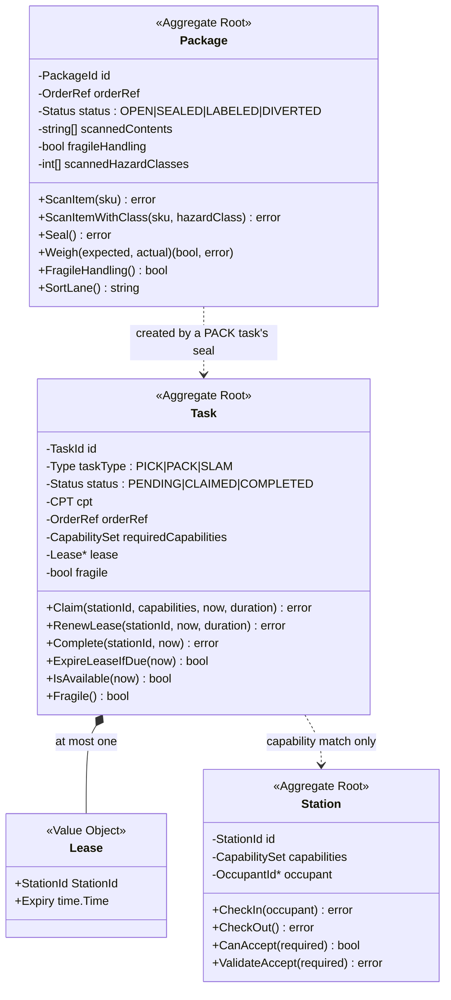

# Aggregates & invariants

Three aggregate roots, each enforcing its own invariants in pure Go with no
framework or SQL types anywhere near them. Every invariant listed here has a
**failing-path** unit test — asserting the rule *rejects* the bad case, not
merely that the happy path works.



`Task` and `Package` are linked only by `OrderRef` — a value, not a reference.
Neither aggregate holds a pointer to the other, and neither is loaded to
mutate the other. That is what keeps them separate consistency boundaries.

## Task

The unit of physical work. Its invariants are the reason this context exists.

| # | Invariant | Enforced by | Typed error | HTTP |
| --- | --- | --- | --- | --- |
| T1 | **At most one active claim.** A task with an unexpired lease cannot be claimed again. | `Task.Claim` | `task.ErrAlreadyClaimed` | `409` |
| T2 | **A claim requires matching capabilities.** The claiming station's capability set must contain every required capability. | `Task.Claim` → `CapabilitySet.HasAll` | `task.ErrCapabilityMismatch` | `422` |
| T3 | **An expired lease frees the task.** A lapsed claim returns the task to `Pending` before any further decision is made. | `Task.ExpireLeaseIfDue`, called from `Claim`, and checked in `RenewLease` / `Complete` | `task.ErrNotClaimed` on renew/complete | `409` |
| T4 | **No double-complete.** A completed task rejects every further operation. | `Task.Claim` / `RenewLease` / `Complete` | `task.ErrAlreadyCompleted` | `409` |
| T5 | **Only the claim owner may renew or complete.** | `Task.RenewLease`, `Task.Complete` | `task.ErrNotOwner` | `409` |
| T6 | **Renew/complete require an active claim.** Acting on a `Pending` task is rejected. | `Task.RenewLease`, `Task.Complete` | `task.ErrNotClaimed` | `409` |

### The ordering inside `Claim` is itself an invariant

```go
func (t *Task) Claim(stationId, stationCapabilities, now, leaseDuration) error {
    if t.status == Completed        { return ErrAlreadyCompleted }
    t.ExpireLeaseIfDue(now)         // an expired lease implicitly frees the task
    if t.status == Claimed          { return ErrAlreadyClaimed }
    if !stationCapabilities.HasAll(t.requiredCapabilities) { return ErrCapabilityMismatch }
    t.status = Claimed
    t.lease = &Lease{StationId: stationId, Expiry: now.Add(leaseDuration)}
    return nil
}
```

Expiry is evaluated **before** the already-claimed check. Reverse those two
lines and a stale claim would permanently block the task — the very failure
the lease was introduced to prevent. This is checked by a failing-path test,
not left to code review.

Note also that `now` is a *parameter*. The domain never calls `time.Now()`;
time enters through `ports.Clock` at the application layer. That is what makes
lease expiry testable with a fixed clock instead of `time.Sleep`.

### `IsAvailable` vs `ExpireLeaseIfDue`

Two closely related methods with a deliberate difference:

- `IsAvailable(now)` is a **pure query** — true if `Pending`, or `Claimed`
  with a lapsed lease. It reports what a caller *would* find, without
  mutating.
- `ExpireLeaseIfDue(now)` **mutates**, returning `true` if it freed the task,
  so the caller knows it must persist and publish `LeaseExpired`.

Repositories use the first to filter candidates; the sweep uses the second.

## Station

A work position. Its job in the model is small on purpose: hold the capability
set that filters what its holder can pull.

| # | Invariant | Enforced by | Typed error | HTTP |
| --- | --- | --- | --- | --- |
| S1 | **One occupant at a time.** A second check-in is rejected. | `Station.CheckIn` | `station.ErrOccupied` | `409` |
| S2 | **Check-out requires an occupant.** | `Station.CheckOut` | `station.ErrNotOccupied` | `409` |
| S3 | **A station cannot accept a task it lacks capabilities for.** | `Station.ValidateAccept` → `CanAccept` | `station.ErrCapabilityMismatch` | `422` |

`OccupantId` is an opaque string. There is no roster, no certification record,
no shift window — those belong to `workforce-management`, which stops at the
process-path boundary. Keeping `Station` this thin is what keeps that boundary
from leaking.

:::note Honest status
Occupancy (`CheckIn` / `CheckOut`) is fully modelled and unit-tested on the
aggregate, but no HTTP endpoint exposes it today, and `ClaimNext` does not
require a station to be occupied before it can claim. The registered
capability set is the only station state the dispatch path reads. `POST /stations`
returns `occupied` in its response, always `false` for a freshly registered
station.
:::

## Package

Pack output: an order becoming a sealed carton, then passing or failing the
SLAM weigh-check.

| # | Invariant | Enforced by | Typed error | HTTP |
| --- | --- | --- | --- | --- |
| P1 | **Cannot seal without scanned contents.** An empty carton is never sealed. | `Package.Seal` | `pack.ErrNoScannedContents` | `422` |
| P2 | **Cannot seal twice**, and cannot scan into a non-`Open` package. | `Package.Seal`, `Package.ScanItem` | `pack.ErrAlreadySealed` | `409` |
| P3 | **SLAM requires a sealed package.** | `Package.Weigh` | `pack.ErrNotSealed` | `409` |
| P4 | **SLAM runs once.** A labelled or diverted package rejects a second weigh-check. | `Package.Weigh` | `pack.ErrAlreadyProcessed` | `409` |
| P5 | **SLAM diverts on weight discrepancy.** If `\|actual − expected\| > WeightTolerance` the package becomes `DIVERTED` instead of `LABELED`. | `Package.Weigh` | *(not an error — a domain outcome)* | `200` |
| P6 | **Same-package DOT hazard segregation.** A scanned item's hazard class must be compatible with every already-scanned item's hazard class, per a class-level 49 CFR §177.848-derived matrix. An unclassified item (hazard class 0) never triggers or blocks this — fail-open. | `Package.ScanItemWithClass` → `pack.IsSegregationIncompatible` | `pack.ErrPackageSegregationViolation` | `409` |

P5 is worth dwelling on: a diverted package is **not an error**. It is a
successful weigh-check with a negative result, so `POST /packages/{id}/slam`
returns `200` with the package in `DIVERTED` status, and raises
`WeightDiscrepancyDetected` *and* `PackageDiverted`. Modelling it as a `4xx`
would conflate "your request was wrong" with "the carton is wrong," and the
second is a normal, expected operational event.

`WeightTolerance` is `0.05`, in whatever unit the caller supplies weights in —
the aggregate does not carry units. In practice the API examples use
kilograms.

## Consistency boundaries

Each aggregate is one transaction. A use case never mutates two aggregates
inside one consistency boundary:

- `SealPackage` **reads** a `Task` (to validate the caller owns the claim and
  that it is a `PACK` task) but only **writes** the new `Package`.
- `RunSlam` touches only the `Package`.
- `CompleteTask` touches only the `Task`.

The cross-aggregate rule "only the station holding the Pack task's claim may
seal its package" is enforced in the `SealPackage` use case rather than inside
either aggregate — it is a rule *about* two aggregates, so it belongs in the
layer that can see both, not inside one of them.

## Read models are projections, never state

Queue depth is computed from task state on every request via
`TaskRepo.CountByTypeAndStatus(ctx, taskType, task.Pending)`. There is no
counter field on any aggregate, and nothing to keep in sync. The same applies
to any future throughput metric: derive it from the events, do not store it on
the thing the events are about.

## Product-classification-derived handling flags

Two flags carry product-classification information from upstream, added on
`Task` and `Package` respectively — neither is a new aggregate, and neither
changes an existing invariant:

- **`Task.Fragile()`** — set once at construction (`task.New`, threaded
  through `CreateTask`), stamped by `wes-work-planning` at release time from
  `inventory-storage`'s `ProductClassification` concept. It does not gate
  `Claim` — a fragile task claims exactly like any other, on capabilities
  alone.
- **`Package.FragileHandling()`** — set once at construction (`pack.New`),
  derived by `SealPackage` from the owning task's `Fragile` flag rather than
  accepted as a separate caller-supplied argument. This keeps the derivation
  in one place: the flag rides in on the Task the same way CPT and
  `requiredCapabilities` already do, and `SealPackage` — which already loads
  the Task to validate claim ownership — reads it off that same load.

Hazmat handling needed **no structural change**: `requiredCapabilities`
already accepts arbitrary capability strings, `Task.Claim`'s
`CapabilitySet.HasAll` check already enforces them, and `RegisterStation`
already accepts arbitrary capabilities for a station. `hazmat` is simply
documented as a known value in the [ubiquitous
language](../business-context/ubiquitous-language.md) — the mechanism
already existed. See [ADR-0009](../adr/0009-fragile-and-hazmat-handling-flags.md)
for the full reasoning.

## Live per-item DOT hazard classification, segregation, and `SortLane`

A second, later addition ([ADR-0010](../adr/0010-package-segregation-and-sort-lane.md))
extends `Package` further, for a concern `Task.Fragile()`'s release-time
stamping pattern does not fit: a Pack task's scanned contents are
discovered live at the scan station, not known when the task was
released, so the per-SKU DOT hazard class of each scanned item is looked
up **live, synchronously, per SKU** inside `SealPackage` — via the new
`ports.ProductClassificationLookup` outbound port, permissive-by-default —
rather than stamped on `Task` upstream.

- **`Package.ScannedHazardClasses()`** — the DOT hazard class (1-9)
  recorded for each already-scanned item that came back Hazmat-classified
  from the lookup. Checked via `pack.IsSegregationIncompatible` against
  every prior scanned item's class before appending — invariant P6 above.
- **`Package.SortLane()`** — derived, not stored: `HAZMAT_LANE` if any
  scanned item carried a hazard class, else `FRAGILE_NO_TILT` if
  `FragileHandling()`, else `STANDARD`. Computed on every call from the
  two inputs above, so it can never drift from them.

`SealPackage`'s per-item lookup fails open for a single SKU's transport
error (that SKU is treated as unclassified, the rest of the seal
proceeds) — a deliberate asymmetry with `inventory-storage`'s `StowStock`,
which fails closed for a *classified* SKU's placement-lookup error. See
ADR-0010 for the full reasoning on both points.
