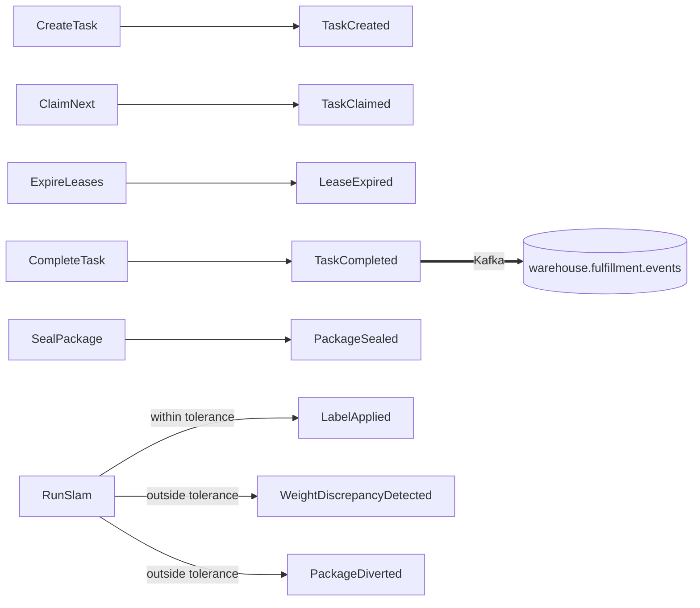

# Domain events

Nine past-tense facts, all defined in `internal/domain/shared/events.go`.
Every one satisfies the same tiny interface:

```go
type DomainEvent interface {
    EventName() string
    OccurredAt() time.Time
}
```

Events are **deliberately thin** — most carry only the aggregate id. Enrichment
for the wire happens in the outbound adapter, never on the event itself. See
[ADR-0004](../adr/0004-kafka-integration-events-and-envelope.md) for why.

## The catalogue

| Event | Aggregate | Raised when | Payload fields | Published externally? |
| --- | --- | --- | --- | --- |
| `TaskCreated` | Task | `CreateTask` puts a new unit of work in the pool | `TaskId` | No — in-process only |
| `TaskClaimed` | Task | `ClaimNext` leases a task to a station | `TaskId`, `StationId` | No — in-process only |
| `LeaseExpired` | Task | `ExpireLeases` frees a task whose lease lapsed | `TaskId` | No — in-process only |
| `TaskCompleted` | Task | `CompleteTask` succeeds | `TaskId`, `StationId` | **Yes** — Kafka, `warehouse.fulfillment.events` |
| `ItemPicked` | Task | *(defined; not raised today — see below)* | `TaskId` | No |
| `PackageSealed` | Package | `SealPackage` seals a carton | `PackageId` | No — in-process only |
| `WeightDiscrepancyDetected` | Package | SLAM finds actual weight outside tolerance | `PackageId`, `ExpectedWeight`, `ActualWeight` | No — in-process only |
| `LabelApplied` | Package | SLAM passes and the shipping label is applied | `PackageId` | No — in-process only |
| `PackageDiverted` | Package | SLAM fails and the package is routed off the standard path | `PackageId` | No — in-process only |

:::caution Published ≠ defined
Only **`TaskCompleted`** is currently carried outside the process. The other
eight go to `ports.EventPublisher`, which by default is the log publisher —
they are real domain events with real subscribers *in process*, but they are
not part of the integration contract yet. `apis/asyncapi.yaml` documents all
nine as the full catalogue and says so per message; this table is the same
truth in one place.

`ItemPicked` is the one event that is defined and tested but never raised by
any use case. The Pick path is currently modelled at task granularity (claim →
complete) rather than item granularity. It stays in the catalogue because it
is part of the intended model, and removing it would lose that intent.
:::

## Which use case raises what



`RegisterStation` and `GetQueueDepth` raise **nothing**. Registering a station
is an operational action with no fact in the existing nine that fits it, and
the deliberate choice was not to invent a tenth event just for symmetry — an
event catalogue padded with facts nobody consumes is worse than a short honest
one. `GetQueueDepth` is a pure read.

## The one event with two facts

`RunSlam` publishes **two** events on the failure branch, in a single call:

```go
uc.Publisher.Publish(ctx,
    shared.NewWeightDiscrepancyDetected(packageId, expectedWeight, actualWeight, now),
    shared.NewPackageDiverted(packageId, now),
)
```

They are separate on purpose. `WeightDiscrepancyDetected` is the
**measurement** — it carries both weights and is what a quality or
loss-prevention consumer wants. `PackageDiverted` is the **routing decision** —
it is what a materials-handling consumer wants. Collapsing them into one event
would force every consumer to care about both concerns.

Note the argument order: the event is constructed as
`(packageId, expected, actual, now)` while the use case's own signature is
`Execute(ctx, packageId, actualWeight, expectedWeight)`. The API request body
names both fields explicitly (`actualWeight`, `expectedWeight`) so callers are
never relying on positional order.

## Naming convention on the wire

Externally published events use the CloudEvents `type` convention shared
across the platform:

```
com.warehouse.<subdomain>.<bounded-context>.<entity>.<EventName>
```

For this context, for example:

```
com.warehouse.wes.fulfillment-execution.task.TaskCompleted
com.warehouse.wes.fulfillment-execution.package.PackageDiverted
```

The `type` attribute encodes the full DDD coordinates of the fact — subdomain,
bounded context, aggregate, event — so a consumer can route or filter purely
on `type` without opening `data`.

:::warning Contract vs. current wire format
`apis/asyncapi.yaml` specifies the CloudEvents 1.0 structured envelope
(`specversion` / `id` / `source` / `type` / `subject` / `time` /
`datacontenttype` / `data`) on channel
`warehouse.fulfillment-execution.events`.

The Kafka publisher in `internal/adapters/outbound/kafka/publisher.go` today
writes the **older flat platform envelope**
(`event_id` / `event_type` / `occurred_at` / `source` / `data`) to topic
**`warehouse.fulfillment.events`**, and that is what `wes-work-planning`'s
consumer actually reads. The AsyncAPI document describes the target contract;
the code has not migrated to it yet. Both the channel name and the envelope
shape differ.

This is stated plainly rather than papered over — see the
[Events reference](../api-reference/events.md) for both shapes side by side.
:::

## Why the events stay thin

`TaskCompleted` carries only `TaskId` and `StationId`. The wire format needs a
third field, `work_unit_id`, so Work Planning can correlate the completion
back to the unit it released.

That field is **not** added to the domain event. Instead the Kafka publisher
looks the task back up through `ports.TaskRepo` and reads `OrderRef()`:

```go
t, err := p.Tasks.FindById(ctx, tc.TaskId)
...
Data: TaskCompletedData{
    TaskId:     string(tc.TaskId),
    StationId:  string(tc.StationId),
    WorkUnitId: workUnitId,   // enriched here, in the adapter
}
```

The reason is that `work_unit_id` is an *integration* concern — it exists
because a particular downstream consumer needs a particular correlation key.
Pushing it into the domain event would make the domain model shaped by a
consumer's needs. The same repo-lookup-enrichment pattern is used in
`inventory-storage`'s publisher for `ReservationRevoked`, so it is a platform
convention rather than a local hack.

## Fragile/FragileHandling did not extend any event payload

The same "events stay thin" discipline applied when `Task.Fragile` and
`Package.FragileHandling` were added: `TaskCreated` still carries only
`TaskId`, and `PackageSealed` still carries only `PackageId`. Both flags are
already visible on their aggregate's own GET response
(`GET /tasks/{id}` — not yet a route today, but `TaskResponse` carries
`fragile`; the `POST /tasks` and `claim-next` responses already do — and the
`POST /tasks/{id}/seal-package` response carries `fragileHandling`), so
nothing consuming these events in-process needs the value pushed onto the
event itself. If a future external consumer needs `fragile` on the wire, the
same repo-lookup-enrichment pattern used for `TaskCompleted`'s
`work_unit_id` is the template to follow — enrich in the adapter, not the
domain event.
