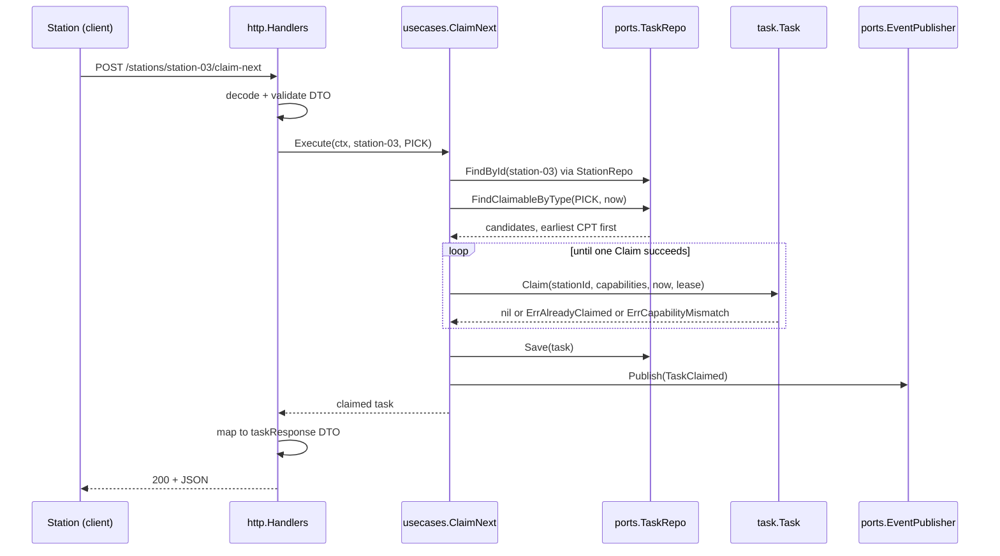

# Use cases & ports

The application layer is one struct per use case, each holding its
dependencies as plain fields. There is no DI container and no base class. Each
use case depends only on the domain and on `ports` — never on an adapter.

## The nine use cases

| # | Use case | Signature (abridged) | Raises | Endpoint |
| --- | --- | --- | --- | --- |
| 1 | `CreateTask` | `Execute(ctx, taskType, cpt, orderRef, required) (*Task, error)` | `TaskCreated` | `POST /tasks` |
| 2 | `ClaimNext` | `Execute(ctx, stationId, taskType) (*Task, error)` | `TaskClaimed` | `POST /stations/{stationId}/claim-next` |
| 3 | `RenewLease` | `Execute(ctx, taskId, stationId) error` | — | `POST /tasks/{id}/renew-lease` |
| 4 | `CompleteTask` | `Execute(ctx, taskId, stationId) error` | `TaskCompleted` | `POST /tasks/{id}/complete` |
| 5 | `SealPackage` | `Execute(ctx, taskId, stationId, contents) (*Package, error)` | `PackageSealed` | `POST /tasks/{id}/seal-package` |
| 6 | `RunSlam` | `Execute(ctx, packageId, actualWeight, expectedWeight) error` | `LabelApplied` **or** `WeightDiscrepancyDetected` + `PackageDiverted` | `POST /packages/{id}/slam` |
| 7 | `GetQueueDepth` | `Execute(ctx, taskType) (int, error)` | — | `GET /queues/{taskType}/depth` |
| 8 | `ExpireLeases` | `Execute(ctx) (int, error)` | `LeaseExpired` per task freed | `POST /tasks/expire-leases` |
| 9 | `RegisterStation` | `Execute(ctx, stationId, capabilities) (*Station, error)` | — | `POST /stations` |

The first eight are the set named in `CLAUDE.md`; `RegisterStation` was added
later to close a real gap — without it, a freshly started server had no way to
create a `Station` over HTTP, so every `claim-next` call returned "station not
found" and the pull-dispatch flow could not be exercised end to end.

## Notes on the ones with subtleties

### `ClaimNext` — the pull dispatcher

```go
st, _ := uc.Stations.FindById(ctx, stationId)          // capabilities come from the registered Station
if st == nil { return nil, ErrStationNotFound }

now := uc.Clock.Now()
candidates, _ := uc.Tasks.FindClaimableByType(ctx, taskType, now)   // earliest-CPT-first

for _, t := range candidates {
    if err := t.Claim(stationId, st.Capabilities(), now, leaseDuration); err == nil {
        uc.Tasks.Save(ctx, t)
        uc.Publisher.Publish(ctx, shared.NewTaskClaimed(t.Id(), stationId, now))
        return t, nil
    }
}
return nil, ErrNoClaimableTask
```

Three things worth noticing:

1. **Capabilities are resolved server-side.** The ubiquitous-language name is
   `claimNext(stationId, capabilities)`, but the HTTP request body carries only
   `taskType` — the capability set comes from the persisted `Station`. A client
   cannot claim work by *asserting* capabilities it does not have. The
   conceptual signature and the wire signature differ on purpose.
2. **The loop skips rather than fails.** If the earliest-CPT candidate does not
   match this station's capabilities, `Claim` returns an error and the loop
   simply moves to the next candidate. The result is "the earliest-CPT task
   this station can actually do."
3. **An empty result is `ErrNoClaimableTask`, not an empty 200.** An idle
   station gets a definite answer, mapped to `409` — see
   [ADR-0005](../adr/0005-rfc-7807-problem-details.md) for the status-code
   reasoning.

### `SealPackage` — a cross-aggregate rule in the right place

It reads the `Task` to check three things — that it exists, that it is a
`PACK` task (`ErrWrongTaskType`), and that `stationId` holds the active claim
(`task.ErrNotOwner`) — then writes only the new `Package`. Neither aggregate
is asked to know about the other; the rule lives in the layer that can see
both.

### `ExpireLeases` — the sweep

Takes no `now` argument: time comes from `ports.Clock`. It walks every
`Claimed` task, calls `ExpireLeaseIfDue`, and for each task it frees, saves it
and publishes `LeaseExpired`, returning the count. On a save or publish error
it returns the count freed *so far* alongside the error rather than zero — a
partial sweep is reported honestly.

### `RegisterStation` — idempotent by design

Re-registering an existing `stationId` **updates** its capability set rather
than erroring. Recertifying a station is a legitimate operational action, not
a conflict. It publishes nothing: none of the nine existing domain events fits
"a station was registered," and inventing a tenth purely for symmetry was
rejected.

## The six outbound ports

All in `internal/application/ports/ports.go`. The application layer depends on
these interfaces; adapters implement them.

| Port | Methods | Implemented by |
| --- | --- | --- |
| `TaskRepo` | `Save`, `FindById`, `FindClaimableByType`, `FindAllClaimed`, `CountByTypeAndStatus` | `memory`, `postgres` |
| `StationRepo` | `Save`, `FindById` | `memory`, `postgres` |
| `PackageRepo` | `Save`, `FindById` | `memory`, `postgres` |
| `EventPublisher` | `Publish(ctx, events...)` | `events` (log/buffered), `kafka` |
| `Clock` | `Now()` | `memory.SystemClock`, fixed clocks in tests |
| `ProcessedEvents` | `MarkProcessed(ctx, eventId) (bool, error)` | `memory`, `postgres` |

### Two ports that carry design weight

**`Clock`** exists so that lease expiry is deterministic. Every use case that
cares about time takes `now` from `uc.Clock.Now()` and passes it *into* the
domain. No domain method calls `time.Now()`. A test asserting "an unrenewed
lease frees the task after five minutes" advances a fixed clock; it does not
sleep.

**`ProcessedEvents`** is what makes Kafka's at-least-once delivery safe.
`MarkProcessed` returns `true` only if this call newly recorded the id — so
the consumer's check is a single atomic operation, not a read-then-write race.
The Postgres adapter backs it with a `processed_events (event_id PRIMARY KEY,
processed_at)` table, where the primary-key violation *is* the deduplication;
the memory adapter uses a mutex-guarded map.

### `FindClaimableByType` carries the dispatch policy

Its contract is "Pending or lease-expired tasks of this type, **ordered by
earliest CPT first**." Because `ClaimNext` has no optimiser, that ordering
*is* the dispatch policy — any future sophistication (aisle batching,
interleaving) would have to change this query, which is exactly where it
should live.

## How the layers connect



The handler never touches a domain type on the way out — it maps to a DTO
defined in `internal/adapters/inbound/http/dto.go`. Domain structs are not
serialised onto the wire.
