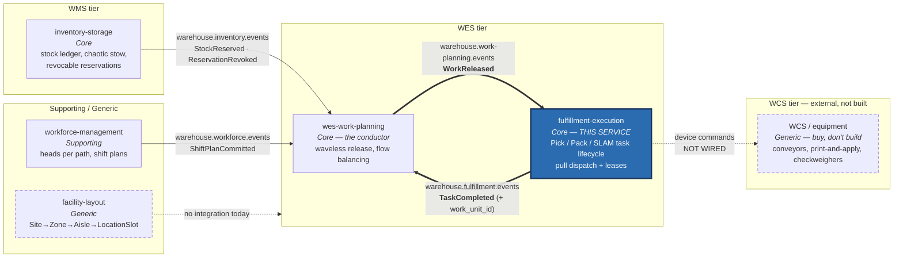
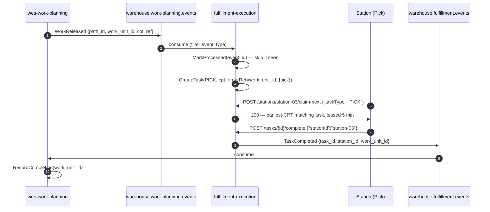

# Context map

`warehouse-systems` is five Go services, one bounded context each, plus an
external WCS tier that is not built. This page is honest about the difference
between **wired** (a real topic, a real adapter, running code) and
**strategic** (a real relationship in the domain, with no wire yet).

## What is actually wired today

**Bold double arrows** are this service's own two edges, both live and
exercised by real smoke tests. **Dashed arrows** are relationships that exist
in the domain but have no code behind them.

## This service's two real edges

### 1. Inbound — `WorkReleased` from `wes-work-planning`

- **Topic:** `warehouse.work-planning.events`
- **Adapter:** `internal/adapters/inbound/kafka/consumer.go`, consumer group
  `fulfillment-execution`
- **Filter:** `event_type == "WorkReleased"`; everything else on the topic is
  ignored
- **Effect:** calls the existing `CreateTask` use case — a released work unit
  becomes a `Task` in this service's pool
- **Idempotency:** `ProcessedEvents.MarkProcessed(event_id)` before creating,
  so a redelivery produces no duplicate task

### 2. Outbound — `TaskCompleted` to `wes-work-planning`

- **Topic:** `warehouse.fulfillment.events`
- **Adapter:** `internal/adapters/outbound/kafka/publisher.go`, active when
  `EVENT_PUBLISHER=kafka`
- **Payload:** `task_id`, `station_id`, and `work_unit_id` — the last
  backfilled via a `TaskRepo` lookup of the task's `OrderRef()`
- **Downstream:** `wes-work-planning` consumes it and calls its own
  `RecordCompletion(workUnitId)`

Together these two edges form a closed loop: Work Planning releases, this
service executes, Work Planning learns that it landed. The repo's integration
notes call it the **drum-buffer-rope feedback edge: Execution →
Orchestration**. Without the return edge the conductor would be releasing into
a void.

## What is deliberately not wired

### `warehouse-console` — a browser client, not a bounded-context edge

This service also gained a `GET /tasks?orderRef=` read endpoint, a `web/`
Module Federation remote (`fulfillment-mfe`), and CORS middleware, all as
this repo's local adoption of the fleet-wide micro-frontend console
architecture (canonical decision in `warehouse-ops-agent`'s own ADR-0002;
this repo's adoption side is [ADR-0013](../adr/0013-fulfillment-mfe-console-adoption.md)).
`warehouse-console` is not drawn as a bounded context in the diagram above —
it is a browser SPA that composes this service's own remote alongside the
other five, plus a BFF hosted in `warehouse-ops-agent` for the one
cross-cutting Order Lifecycle screen. It calls this service's REST API over
HTTP exactly like any other client; it has no domain model of its own and
no wire-level relationship worth drawing as a context-mapping edge.

### `workforce-management` — no edge, on purpose

There is no topic, no HTTP call, no shared type between these two services,
and that absence is the design rather than an omission.

Workforce Management owns "who is on shift, on which process path, at what
rate," and **stops at the process-path boundary** — its own charter states it
"never links an associate to a specific task." From this side, `Station` holds
capabilities and an opaque `OccupantId`, with no roster behind it.

Both sides give the same reason: the two contexts change at **completely
different cadences** — shifts versus seconds. The only thing they share is a
*published language* for capability names (`pick`, `pack`, `slam`), which the
`WorkReleased` consumer uses when deriving required capabilities.

### `inventory-storage` — indirect only

Stock reality reaches this service transitively. `inventory-storage` publishes
`StockReserved` / `ReservationRevoked`; `wes-work-planning` projects them into
its `UsableInventoryObserved` read model and factors them into *what it
releases*. By the time a `WorkReleased` event arrives here, that decision is
already made. A `Task` carries an `orderRef`, never a SKU or a bin.

### `facility-layout` — no relationship at all

`facility-layout` is the newest service and currently has **no live
integration with any of the other four** — an in-process log publisher, no
AsyncAPI spec. This service has no notion of physical location: a `Task` says
*what* work and *by when*, never *where*. There is no edge in either
direction, and none is drawn as if there were.

### WCS / equipment — strategic, not built

Strategically this service is upstream of WCS: it decides a carton should be
sealed and labelled; WCS drives the conveyor, the print-and-apply head and the
check-weigher. `apis/openapi.yaml` states plainly that this service "does not
drive physical WCS/equipment directly over this API (that's a separate command
channel)."

There is no adapter, no topic, and no command channel in this repository. The
edge is drawn dashed because it is the real shape of the system, not because
anything implements it.

As of [ADR-0015](../adr/0015-wcs-equipment-anti-corruption-seam.md), the
boundary is no longer prose-only: `internal/application/ports.EquipmentCommandPort`
is a real, but deliberately unimplemented, outbound port. No adapter
satisfies it and no use case calls it — it exists so that if a WCS
integration is ever scoped, its vocabulary is translated at that one seam
and never leaks into `Task`, `Package`, or `Station`.

## Strategic relationships in one table

Full reasoning on [Context relationships](../ddd/context-relationships.md).

| Edge | Context-mapping pattern | Wired? |
| --- | --- | --- |
| `wes-work-planning` → this | Customer/Supplier, with an ACL on this side | **Yes** |
| this → `wes-work-planning` | Customer/Supplier (feedback edge) | **Yes** |
| this → WCS | Customer/Supplier + Conformist behind an ACL | No |
| this ↔ `workforce-management` | Published Language (capability names) only | No |
| `inventory-storage` → this | Indirect, via Work Planning | No direct edge |
| `facility-layout` ↔ this | None | No |

## Why the WES tier is two services, not one

The reference model describes Work Orchestration and Task & Labor Management
as a **Partnership** — "they evolve together; sequencing and assignment are
two halves of one optimization loop."

This platform splits them anyway, and it is worth saying why. Work Planning
answers *how much* work should be on the floor and when to release it —
changing when flow-balancing policy changes. Fulfillment Execution answers
*how a released unit safely reaches completion* — changing when dispatch or
claim semantics change. Those are different reasons to change, on different
cadences.

The cost of the split is real: the two must agree on `work_unit_id` as a
correlation key and on the CPT semantics that drive priority. That agreement
is the published language on both topics, and it is exactly what the
`apis/asyncapi.yaml` catalogue documents.
