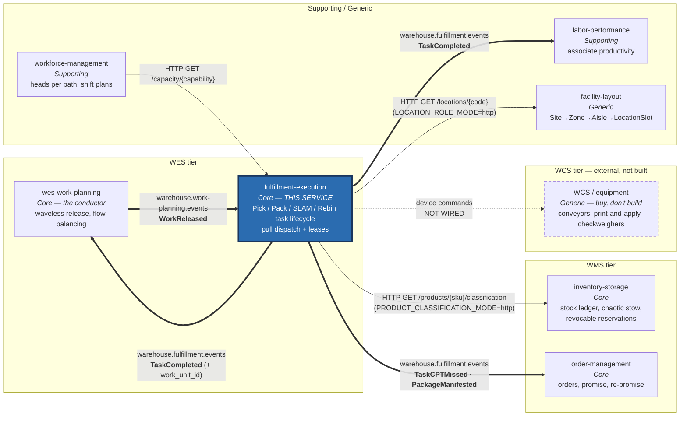
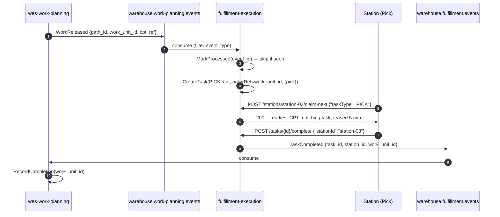

# Context map

`warehouse-systems` is a fleet of Go services, one bounded context each, plus
an external WCS tier that is not built. This page shows this service's own
edges only. This page is honest about the difference
between **wired** (a real topic, a real adapter, running code) and
**strategic** (a real relationship in the domain, with no wire yet).

## What is actually wired today

**Bold double arrows** are Kafka edges, live whenever
`EVENT_PUBLISHER=kafka`. **Single arrows** are synchronous HTTP calls; the
two outbound ones are opt-in and permissive by default (with the mode unset,
the lookup is skipped and the request is accepted unchecked). **Dashed
arrows** are relationships that exist in the domain but have no code behind
them. Upstream edges between *other* services (e.g. inventory-storage →
work-planning) are omitted — see each service's own context map.

## The control loop with Work Planning

### 1. Inbound — `WorkReleased` from `wes-work-planning`

- **Topic:** `warehouse.work-planning.events`
- **Adapter:** `internal/adapters/inbound/kafka/consumer.go`, consumer group
  `fulfillment-execution`
- **Filter:** `event_type == "WorkReleased"`; everything else on the topic is
  ignored
- **Effect:** calls the existing `CreateTask` use case — a released work unit
  becomes a `Task` in this service's pool
- **Idempotency:** `ProcessedEvents.MarkProcessed(event_id)` before creating,
  so a redelivery produces no duplicate task

### 2. Outbound — `TaskCompleted` to `wes-work-planning`

- **Topic:** `warehouse.fulfillment.events`
- **Adapter:** `internal/adapters/outbound/kafka/publisher.go`, active when
  `EVENT_PUBLISHER=kafka`
- **Payload:** `task_id`, `station_id`, and `work_unit_id` — the last
  backfilled via a `TaskRepo` lookup of the task's `OrderRef()`
- **Downstream:** `wes-work-planning` consumes it and calls its own
  `RecordCompletion(workUnitId)`; `labor-performance` also consumes it for
  per-associate attribution (the event carries the claiming associate,
  ADR-0014)

Together these two edges form a closed loop: Work Planning releases, this
service executes, Work Planning learns that it landed. The repo's integration
notes call it the **drum-buffer-rope feedback edge: Execution →
Orchestration**. Without the return edge the conductor would be releasing into
a void.

## The other live edges

### Outbound — `TaskCPTMissed` / `PackageManifested` to `order-management`

Same topic, same publisher. `TaskCPTMissed` is raised by the Clock-driven
`POST /tasks/sweep-cpt-misses` sweep for every still-open task past its CPT;
`PackageManifested` is raised when SLAM labels a package. Order
Management's `RepromiseOrder` consumer uses them to close its promise
feedback loop — see [ADR-0025](../adr/0025-cpt-missed-sweep-and-package-manifested.md).

### Inbound HTTP — `workforce-management` reads installed capacity

`workforce-management` calls `GET /capacity/{capability}` to learn how many
registered stations can serve a capability, so shift planning is bounded by
physical station count ([ADR-0018](../adr/0018-installed-capacity-read-endpoint.md)).
It is a read of this service's `Station` pool, not a shared model: there is
still no roster here — `Station` holds capabilities and an opaque
`OccupantId`, and Workforce Management still stops at the process-path
boundary. The two contexts change at different cadences (shifts versus
seconds) and share only the published language of capability names.

### Outbound HTTP — `inventory-storage` hazard classification (opt-in)

With `PRODUCT_CLASSIFICATION_MODE=http` and `INVENTORY_STORAGE_BASE_URL`
set, `SealPackage` looks up each SKU's DOT hazard class via
`GET /products/{sku}/classification` to enforce package segregation
([ADR-0010](../adr/0010-package-segregation-and-sort-lane.md)).
Everything else about stock still reaches this service only transitively,
through what Work Planning chooses to release.

### Outbound HTTP — `facility-layout` WorkCenter role check (opt-in)

With `LOCATION_ROLE_MODE=http` and `FACILITY_LAYOUT_BASE_URL` set,
`RegisterStation` resolves an optional station `locationCode` via
`GET /locations/{locationCode}` and rejects a known non-WorkCenter role
([ADR-0024](../adr/0024-station-location-code-and-workcenter-role-check.md)).
A `Task` still carries no location — it says *what* work and *by when*,
never *where*.

## What is deliberately not wired

### `warehouse-console` — a browser client, not a bounded-context edge

This service also exposes a `GET /tasks?orderRef=` read endpoint, a `web/`
Module Federation remote (`fulfillment-mfe`), and CORS middleware, all as
this repo's local adoption of the fleet-wide micro-frontend console
architecture (canonical decision in `warehouse-ops-agent`'s own ADR-0002;
this repo's adoption side is [ADR-0013](../adr/0013-fulfillment-mfe-console-adoption.md)).
`warehouse-console` is not drawn as a bounded context in the diagram above —
it is a browser SPA that composes this service's remote alongside the other
services' remotes, plus a BFF hosted in `warehouse-ops-agent`. It calls this
service's REST API over HTTP like any other client and has no domain model
of its own.

### WCS / equipment — strategic, not built

Strategically this service is upstream of WCS: it decides a carton should be
sealed and labelled; WCS drives the conveyor, the print-and-apply head and the
check-weigher. `apis/openapi.yaml` states plainly that this service "does not
drive physical WCS/equipment directly over this API (that's a separate command
channel)."

There is no adapter, no topic, and no command channel in this repository. The
edge is drawn dashed because it is the real shape of the system, not because
anything implements it.

As of [ADR-0015](../adr/0015-wcs-equipment-anti-corruption-seam.md), the
boundary is no longer prose-only: `internal/application/ports.EquipmentCommandPort`
is a real, but deliberately unimplemented, outbound port. No adapter
satisfies it and no use case calls it — it exists so that if a WCS
integration is ever scoped, its vocabulary is translated at that one seam
and never leaks into `Task`, `Package`, or `Station`.

## Strategic relationships in one table

Full reasoning on [Context relationships](../ddd/context-relationships.md).

| Edge | Context-mapping pattern | Wired? |
| --- | --- | --- |
| `wes-work-planning` → this | Customer/Supplier, with an ACL on this side | **Yes** (Kafka) |
| this → `wes-work-planning` | Customer/Supplier (feedback edge) | **Yes** (Kafka) |
| this → `labor-performance` | Published Language (`TaskCompleted`) | **Yes** (Kafka) |
| this → `order-management` | Published Language (`TaskCPTMissed`, `PackageManifested`) | **Yes** (Kafka) |
| `workforce-management` → this | Open Host Service (`GET /capacity/{capability}`) | **Yes** (HTTP) |
| this → `inventory-storage` | Customer/Supplier, ACL on this side | Opt-in (HTTP) |
| this → `facility-layout` | Customer/Supplier, ACL on this side | Opt-in (HTTP) |
| this → WCS | Customer/Supplier + Conformist behind an ACL | No |

## Why the WES tier is two services, not one

The reference model describes Work Orchestration and Task & Labor Management
as a **Partnership** — "they evolve together; sequencing and assignment are
two halves of one optimization loop."

This platform splits them anyway, and it is worth saying why. Work Planning
answers *how much* work should be on the floor and when to release it —
changing when flow-balancing policy changes. Fulfillment Execution answers
*how a released unit safely reaches completion* — changing when dispatch or
claim semantics change. Those are different reasons to change, on different
cadences.

The cost of the split is real: the two must agree on `work_unit_id` as a
correlation key and on the CPT semantics that drive priority. That agreement
is the published language on both topics, and it is exactly what the
`apis/asyncapi.yaml` catalogue documents.
