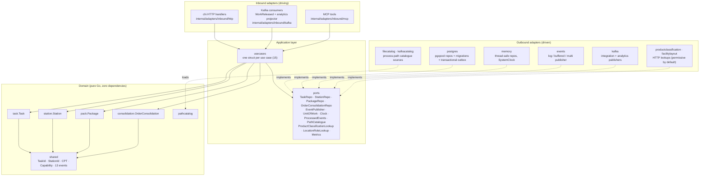

# Architecture

The service is **hexagonal (ports and adapters)**, and the dependency rule is
treated as non-negotiable:

> **Domain depends on nothing. Application depends on domain. Adapters depend
> on application and domain.** No framework or SQL type ever appears in the
> domain layer.



The analytics read side (`cmd/fulfillment-projector`,
`cmd/fulfillment-reports`, `internal/analytics/report`,
`outbound/analyticsstore`) follows the same layering against a separate
analytical database — see [Throughput report](../analytics/throughput-report.md).

Solid arrows are compile-time dependencies; dotted arrows are interface
implementations, which is where the arrows get inverted — the outbound
adapters depend on `ports`, never the reverse.

## Package map

```
cmd/execution/                 main.go — the OLTP composition root, the only place
                               that knows both a pgxpool and a use case exist
cmd/fulfillment-projector/     analytics WRITER: analytics topic -> analytical DB
cmd/fulfillment-reports/       analytics READ-ONLY reader: GET /reports/...
cmd/mcp/                       MCP server (Streamable HTTP)
internal/
  domain/
    task/                      Task aggregate (Pick|Pack|SLAM|Rebin lifecycle, lease, CPT-missed)
    station/                   Station aggregate (occupant, capabilities, locationCode)
    package/                   Package aggregate (seal, segregation, SLAM weigh-check)
    consolidation/             OrderConsolidation — Rebin fan-in tracker
    pathcatalog/               process-path catalogue model (prefix-match lookup)
    shared/                    TaskId, StationId, CPT, Capability, 13 domain events
  analytics/report/            analytical read model + store ports
  application/
    ports/                     OUT interfaces (see Use cases & ports)
    usecases/                  one struct per use case (15 of them)
  adapters/
    inbound/http/              chi router, handlers, DTOs, RFC 7807 error mapping
    inbound/kafka/             WorkReleased consumer + analytics projector consumer
    inbound/mcp/               MCP tools (curated, governance-tested)
    outbound/postgres/         pgxpool repos + migrations + transactional outbox
    outbound/memory/           in-memory repos for tests and local runs
    outbound/events/           log / buffered / multi publisher
    outbound/kafka/            integration + analytics publishers
    outbound/analyticsstore/   analytical DB writer + read-only reader
    outbound/filecatalog/      process-path catalogue file loader
    outbound/kafkacatalog/     process-path catalogue Kafka replay
    outbound/productclassification/  inventory-storage hazard lookup (opt-in)
    outbound/facilitylayout/   facility-layout location-role lookup (opt-in)
  observability/               OpenTelemetry traces, metrics, slog
  architecture/                arch-go fitness tests (test-only package)
migrations/                    golang-migrate SQL files (+ migrations/analytics/)
apis/                          openapi.yaml + asyncapi.yaml (the published contracts)
features/                      Gherkin acceptance specs, run by godog
web/                           fulfillment-mfe Module Federation remote
charts/fulfillment-execution/  Helm chart
```

The `package` directory is imported as `pack` in Go, because `package` is a
reserved keyword — the aggregate is still called `Package` in the ubiquitous
language, and only the Go identifier bends.

## The dependency rule is executable, not aspirational

`internal/architecture/` encodes the rule as real Go tests
using [arch-go](https://github.com/arch-go/arch-go) — the Go equivalent of
ArchUnit. Seven subtests (five in `architecture_test.go`, two MCP-specific in
`fitness_test.go`) run on every push in the `arch-test` CI job:

| Subtest | What it forbids |
| --- | --- |
| `domain has no internal dependencies except domain` | Any import from `internal/domain/**` into application or adapters |
| `application depends only on domain` | Application reaching for a concrete adapter |
| `inbound adapters do not depend on outbound adapters` | The HTTP layer talking to pgx directly |
| `outbound adapters do not depend on inbound adapters` | A repo importing an HTTP DTO |
| `only cmd wires every layer together` | Wiring leaking out of the composition root |
| `mcp adapter depends only on application and domain` | MCP tools reaching into other adapters |
| `nothing else depends on the mcp adapter` | Other packages importing MCP tool code |

Rationale and the alternatives considered are in
[ADR-0001](../adr/0001-hexagonal-ports-and-adapters.md) and
[ADR-0006](../adr/0006-arch-go-architecture-fitness-tests.md).

## Composition root

`cmd/execution/main.go` is the single place where concrete adapters are chosen,
entirely from environment variables:

- `DATABASE_URL` **unset** → in-memory repositories (`memory.NewTaskRepo()` and
  friends). This is why the service runs with a single `go run` and no
  infrastructure.
- `DATABASE_URL` **set** → migrations are applied via `golang-migrate`, then
  `pgxpool` repositories are wired.
- `EVENT_PUBLISHER=kafka` → the outbound Kafka publisher replaces the default
  log publisher for `ports.EventPublisher`. Note that the same interface backs
  both, so no use case knows which one it got.
- The `WorkReleased` Kafka consumer always starts, reading
  `warehouse.work-planning.events` from `KAFKA_BROKERS`.

Every use case receives its dependencies as struct fields — there is no DI
container, no service locator, and no global state. The wiring is about thirty
readable lines.

## Read models are projections

Queue depth (`GET /queues/{taskType}/depth`) is computed from task state via
`TaskRepo.CountByTypeAndStatus`, not stored as a counter on an aggregate. The
same discipline applies to any throughput metric: read models are
**projections**, never denormalised fields that can drift from the facts that
produced them.
