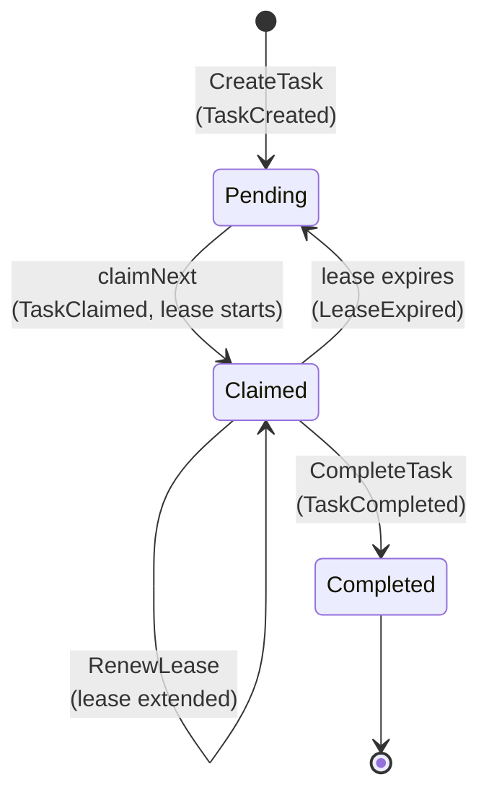
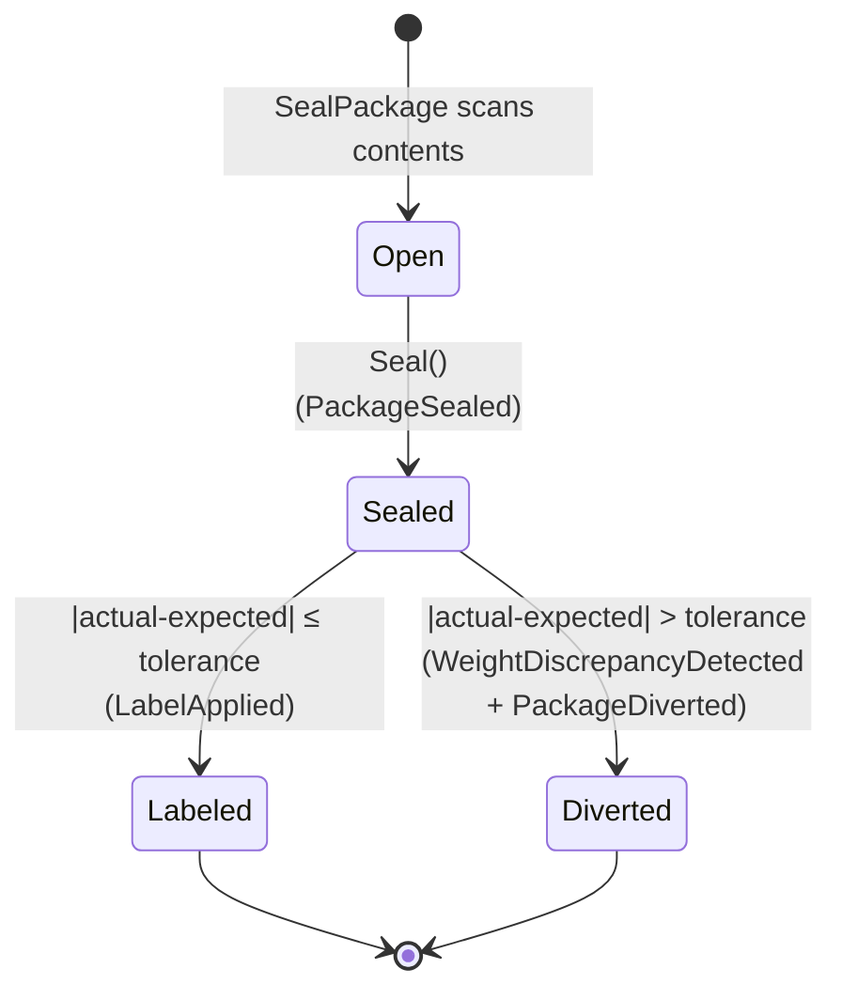

# The task lifecycle

A `Task` is a unit of physical work with a type (`PICK`, `PACK`, or `SLAM`), a
**CPT** deadline that determines its priority, an `orderRef` back to the work
unit that produced it, and a set of `requiredCapabilities` a station must hold
to claim it.

Its lifecycle has exactly three states and one cycle:

The `Claimed → Pending` edge is the whole point. Nothing else in the model
would prevent a task from being silently stranded on a station whose scanner
died.

## State by state

### Pending

The task is in the pool. It is visible to `claimNext` for any station whose
capability set is a superset of the task's `requiredCapabilities`, and it
counts toward the queue-depth read model for its type.

`GET /queues/{taskType}/depth` counts exactly the tasks in this state — not
claimed-but-stale ones. A backlog number that quietly included leased work
would misreport how much work is actually available to pull.

### Claimed (leased)

A station holds an active claim with an expiry timestamp. The default lease
duration is **5 minutes** (`usecases.DefaultLeaseDuration`), overridable at the
composition root.

While claimed:

- No other station can claim it. `Task.Claim` returns `ErrAlreadyClaimed`.
- Only the owning station may renew or complete it — anyone else gets
  `ErrNotOwner`, mapped to HTTP `409`.
- The owner may extend the lease indefinitely via
  `POST /tasks/{id}/renew-lease` — the right move for legitimately long work
  (a deep-aisle pick, an awkward carton) rather than picking one lease
  duration long enough for the worst case.

### Completed

Terminal. A second completion attempt returns `ErrAlreadyCompleted` (HTTP
`409`) — there is no double-complete. Completion is what closes the control
loop: the `TaskCompleted` event is published onto
`warehouse.fulfillment.events` enriched with the original `work_unit_id`, and
`wes-work-planning` consumes it to call its own `RecordCompletion`.

## How a lease actually expires

Expiry is evaluated in two complementary places, and both matter:

1. **Lazily, at the point of use.** `Task.Claim`, `Task.RenewLease` and
   `Task.Complete` all call `ExpireLeaseIfDue(now)` (or check
   `lease.expired(now)`) before acting. A stale claim therefore cannot block a
   fresh claim even if no sweep has run yet — and a station trying to complete
   a task whose lease already lapsed gets `ErrNotClaimed`, not a silent
   success.
2. **Eagerly, via the sweep.** `POST /tasks/expire-leases` runs the
   `ExpireLeases` use case, which walks every `Claimed` task, frees the ones
   past expiry, publishes `LeaseExpired` for each, and returns the count
   freed. This is what makes the freed work *visible* in the queue-depth read
   model rather than only becoming visible the next time somebody happens to
   pull.

Both paths take `now` from the injected `ports.Clock`, never from
`time.Now()` inside the domain — which is what makes lease expiry
deterministically testable with a fixed clock rather than with `time.Sleep`.

## Priority: earliest CPT wins

`CPT` (Critical Pull Time) is the deadline by which a task must be completed
for its order to ship on schedule. It is the *only* input to priority — there
is no separate priority field to drift out of sync with the deadline that
actually matters.

`TaskRepo.FindClaimableByType` returns candidates ordered earliest-CPT-first,
and `ClaimNext` takes the first one the station's capabilities satisfy. The
selection is therefore "earliest deadline this station can actually do,"
not "earliest deadline, then fail if the station can't do it."

## The Pack path continues into Package

A `PACK` task's completion is not the end of the story — sealing produces a
`Package`, which then runs the SLAM weigh-check:

See [Aggregates & invariants](../ddd/aggregates-and-invariants.md) for the
exact rules each transition enforces.
